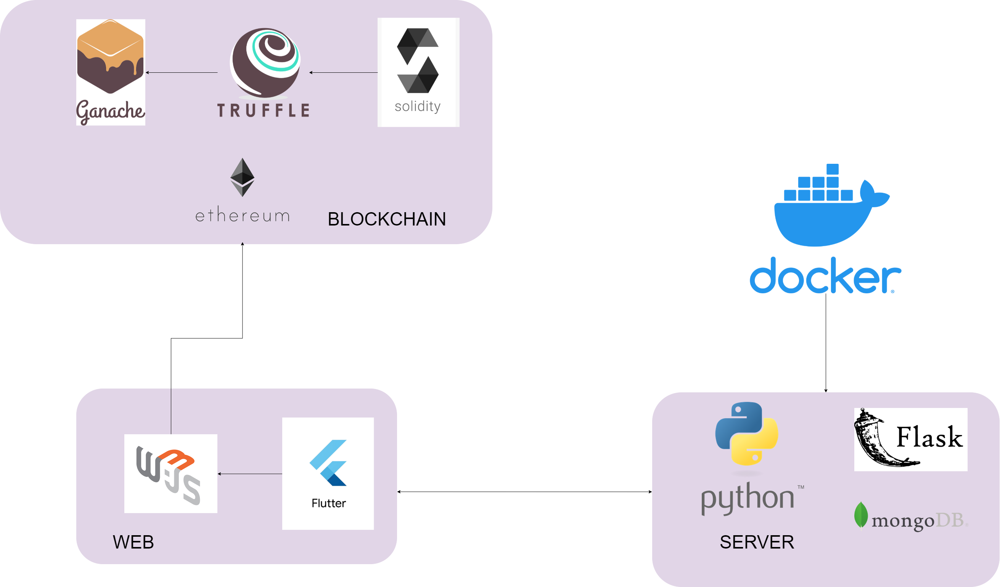
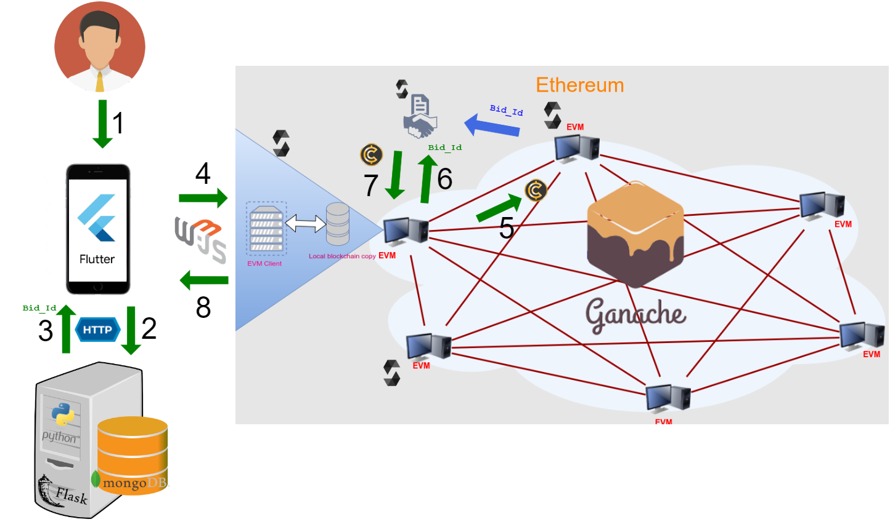

# Projecte de Tecnologies de la Informació

## Summary

### Technologies Diagram



### Transaction Operation Diagram



### Demo Operation

https://user-images.githubusercontent.com/22714366/196254183-c69b154e-46b4-485b-b2b2-693523159c6e.mp4

## Build and Run

Enter the working folder and set the variables with the corresponding IP addresses of each machine in the scripts
```
cd ./src/
```

Build and run the blockchain service from a docker container
```
docker build -f ./blockchain/Dockerfile_BLOCKCHAIN --no-cache --progress=plain -t pti_blockchain . | more
docker run --name pti_blockchain -d -p 8545:8545 pti_blockchain
```

Install Truffle suite 
```
npm install -g truffle
```

View the deployed contracts addresses (not necessary to compilate 'abis' again)
```
truffle networks 
```

Build and run the database from a docker container
```
docker build -f ./database/Dockerfile_DATABASE --no-cache --progress=plain -t pti_database . | more
docker run --name pti_database -d -p 27017:27017 pti_database
```

Fill the database with the initial content (blockchain accounts and default username and password)
```
python3 ./database/init_database_accounts.py
python3 ./database/init_database_users.py
```

Build and run the webserver (backend) from a docker container
```
docker build -f ./webserver/Dockerfile_WEBSERVER --no-cache --progress=plain -t pti_webserver . | more
docker run --name pti_webserver -d -p 80:80 pti_webserver
```

Build and run the frontend app from a docker container (If necessary change the running port in the command, Dockerfile and server_app.py script)
```
docker build -f ./frontend/Dockerfile_FRONTEND --no-cache --progress=plain -t pti_frontend . | more
docker run --name pti_frontend -d -p 80:80 pti_frontend
```

View the 10 accounts (and private keys) configured in the blockchain and the database ([View the file](./src/blockchain/ganache_accounts.json))
```
cat ./blockchain/ganache_accounts.json
```

Import account to Metamask extension using the account private key 

Import the four working Tokens to the Metamask account using the compiled contract addresses ([View the file](./src/blockchain/SmartContract_Addresses.md))

Finally... explore the application!


## Useful commands


Migrate contracts to the blockchain (from the './src/blockchain/' directory where the 'truffle-config.js' file is located)
```
truffle networks --clean
truffle migrate --reset
```

Enter Docker container interactively
```
docker run -it --entrypoint bash <containerName>
```

Stop and Remove Docker container
```
docker stop <containerName>
docker rm <containerName>
```

Check Docker logs
```
docker logs <containerName>
```

Copy from Docker container to host
```
docker cp <containerId>:/file/path/within/container /host/path/target
```

Add SSH Key to the ssh-agent
```
eval $(ssh-agent -s)
ssh-add ~/.ssh/id_rsa_pti_server
```

Fetch a single file from Github
```
git fetch && git checkout origin/master -- ./src/blockchain/Dockerfile_BLOCKCHAIN
```

Build a docker container that will fetch from github using ssh
```
docker build -f ./webserver/Dockerfile_WEBSERVER --no-cache --progress=plain --secret id=id_rsa_pti_server,src=/home/jquintana/.ssh/id_rsa_pti_server -t pti_webserver . | more
```


## Flutter WebApp

```
flutter channel beta
flutter upgrade
flutter config --enable-web

flutter devices

flutter create .
flutter build web
```


## Authors

- Josep Quintana
- Omar Elkassar
- Nil Tosar
- Josep Maria Canela


## TO DO

- [x] Dockerfile for Blockchain (truffle)
- [x] Simple API endpoint
- [x] Truffe Process start
- [x] web3js
- [x] Recompile contracts and get abi address
- [x] Create, block, unblock and delete Bids
- [x] Think how will user_2 approve SELL
- [x] Escrow.sol
- [x] User management
- [ ] Frontend detect if metamask account doesn't match user assigned in DB
- [ ] Flutter
- [ ] Use Docker Hub
- [ ] IPFS
- [ ] Private Blockchain

